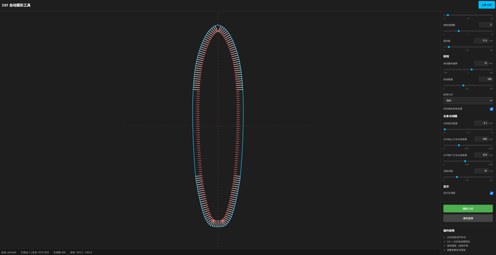

# Surfboard Vacuum Table DXF Generator

English | [中文](README.zh-CN.md)



This is a local web tool for generating DXF machining geometry for a surfboard fabric vacuum table used with Rufa.com / Rufa surfboard sewing equipment.

The intended workflow is simple: import a surfboard outline DXF, select the edge where the suction structure should be placed, then generate perpendicular rays, suction holes, and capsule-shaped slots along that edge. The result can be exported as a new DXF file for downstream fabrication.

Rufa website: [http://rufajx.com/](http://rufajx.com/)

## Key Features

- Upload and preview surfboard outline DXF files in the browser.
- Highlight selectable linework on hover, then click to select a target edge.
- Use `Ctrl + click` to append adjacent edges into one continuous boundary.
- Generate rays, circular suction holes, and capsule-shaped slots from the selected edge.
- Support common left-right symmetric surfboard outlines with automatic vertical/horizontal symmetry guides and a default apex marker.
- Skip ray generation around the pointed nose area so both sides can start from the same distance and remain symmetric.
- Configure no-slot regions above and below the horizontal symmetry axis. Holes are kept in these regions, but capsule slots are omitted.
- Automatically remove overlapping holes. Removed holes are shown as semi-transparent gray preview geometry and are not exported.
- Use fast frontend preview while dragging parameters, while the backend only synchronizes the newest parameter set.
- Export only real machining geometry to DXF. Preview guides, symmetry axes, apex markers, and helper lines are not exported.

## Workflow

1. Prepare a DXF file containing the surfboard outline.
2. Open the tool and click `Upload DXF`.
3. Move the mouse near the surfboard edge and click after the selectable edge is highlighted.
4. Adjust hole, ray, slot, and spacing parameters in the right-side panel.
5. Check the preview to make sure the suction holes and slots are distributed correctly.
6. Click `Save DXF` to download the generated file.

## Parameters

The right-side parameter panel is grouped by purpose.

### Holes

- `Circle Radius`: radius of each suction hole.
- `Circles per Ray`: number of holes generated on each ray.
- `Circle Spacing`: distance between adjacent holes on the same ray.

### Rays

- `Ray Offset`: global offset for ray positions relative to the selected edge.
- `Ray Count`: number of rays generated along the selected edge.
- `Ray Direction`: generate inward or outward from the selected edge.
- `Deduplicate Closed End Rays`: avoids duplicate rays near the endpoints of closed or nearly closed paths. This is automatically ignored when the top gap is non-zero.

### Slots and Gaps

- `Capsule Start Distance`: position of the capsule slot end near the ray origin.
- `Capsule Clearance Distance`: extra safe spacing between capsule slots. If two slots are closer than this threshold allows, the tool shortens only one slot from its outermost hole, while preserving mirrored removal when a symmetry axis is available.
- `No Slot Distance Above Horizontal Axis`: omits capsule slots within this distance above the horizontal symmetry axis.
- `No Slot Distance Below Horizontal Axis`: omits capsule slots within this distance below the horizontal symmetry axis.
- `Top Gap`: distance around the apex where rays are not generated, helping both sides stay symmetric.

### Display

- `Show Generated Geometry`: toggles the generated hole, ray, and slot preview.

Default values are maintained in `DEFAULT_PARAMS` inside [backend/config.py](backend/config.py).

## Quick Start

For the Windows desktop launcher, double-click:

```text
启动桌面管理器.cmd
```

This opens a small control window that:

- starts the local web service automatically;
- shows both `127.0.0.1` and LAN access URLs;
- opens the web page with one button;
- shows service status with a green/red indicator;
- can start/stop the service;
- displays a bounded live website log window;
- stops the web service when the launcher window closes.

The launcher entry point is [launcher.py](launcher.py). It uses only the Python
standard library for the desktop UI and is suitable as the future executable
packaging entry point.

The older console-only startup script is still available:

```text
一键启动服务.cmd
```

The script stops any old local service, starts a new one, and opens:

```text
http://127.0.0.1:8000/
```

Manual startup is also available:

```bash
pip install -r requirements.txt
python -m uvicorn backend.app:app --host 127.0.0.1 --port 8000
```

Or:

```bash
python main.py
```

## Project Structure

```text
backend/
  app.py                    Local web service, HTTP API, and WebSocket
  config.py                 Default parameters, port, and layer names
  state.py                  Session state and parameter model
  dxf_engine/
    loader.py               DXF loading
    svg_exporter.py         DXF-to-SVG preview export
    entity_mapper.py        Mouse hit testing against DXF entities
    path_analyzer.py        Continuous selected edge construction
    geometry_utils.py       Geometry sampling, arcs, and symmetry axis calculation
    circle_generator.py     Rays, holes, slots, overlap pruning, and DXF export entities

frontend/
  index.html                Page structure and parameter panel
  css/
    main.css                Panels, buttons, and parameter section styles
    viewer.css              SVG canvas, hover highlights, and helper line styles
  js/
    app.js                  Main frontend flow
    api.js                  HTTP API wrapper
    websocket.js            Live preview message synchronization
    svg_viewer.js           SVG preview, zoom, pan, and fast frontend rendering
    parameter_panel.js      Parameter inputs and slider synchronization
    selector.js             Selection helper logic

tests/                      Automated tests
Test Files/                 Manual DXF test files
temp/                       Runtime temporary files
```

## Technical Notes

- The backend uses FastAPI and ezdxf for DXF handling.
- The frontend uses plain HTML, CSS, and JavaScript to render the SVG preview.
- The preview has two layers: the original DXF layer and the generated result layer.
- While dragging parameters, the frontend redraws immediately; backend results are synchronized after calculation.
- DXF export is based on the core geometry logic in [backend/dxf_engine/circle_generator.py](backend/dxf_engine/circle_generator.py).

## Testing

Run the full test suite:

```bash
python -m pytest
```

Run the main DXF/generation tests:

```bash
python -m pytest tests/test_dxf_engine.py
```

Check frontend JavaScript syntax:

```bash
node --check frontend/js/svg_viewer.js
node --check frontend/js/parameter_panel.js
node --check frontend/js/app.js
```

## FAQ

### The page did not update

The browser may still be using cached JavaScript or CSS files. Refresh the page first. If it still shows the old version, clear the browser cache and reopen the tool.

### The imported drawing appears as a large gray block

This is usually caused by abnormal DXF-to-SVG stroke width handling. The current version avoids forcing non-scaling strokes on the original imported layer and only applies stable stroke widths to preview helper geometry.

### Parameter dragging feels delayed

The frontend renders the current parameter values immediately, and the backend only keeps the latest parameter set for calculation. If it still feels slow, check whether an old service is occupying the port or whether the browser has cached old files.

### Preview and exported DXF do not match

The preview shown while dragging may be a fast frontend result. After adjustment stops, the backend synchronizes the final result. The exported DXF uses the stable backend geometry as the source of truth.

## Development Notes

- Generated machining entities use dedicated output layers. Helper lines, symmetry axes, apex markers, and range guides are preview-only.
- Automatically removed holes are shown as semi-transparent gray preview geometry and are not exported to DXF.
- After changing geometry generation logic, run at least:

```bash
python -m pytest
node --check frontend/js/svg_viewer.js
node --check frontend/js/parameter_panel.js
node --check frontend/js/app.js
```
