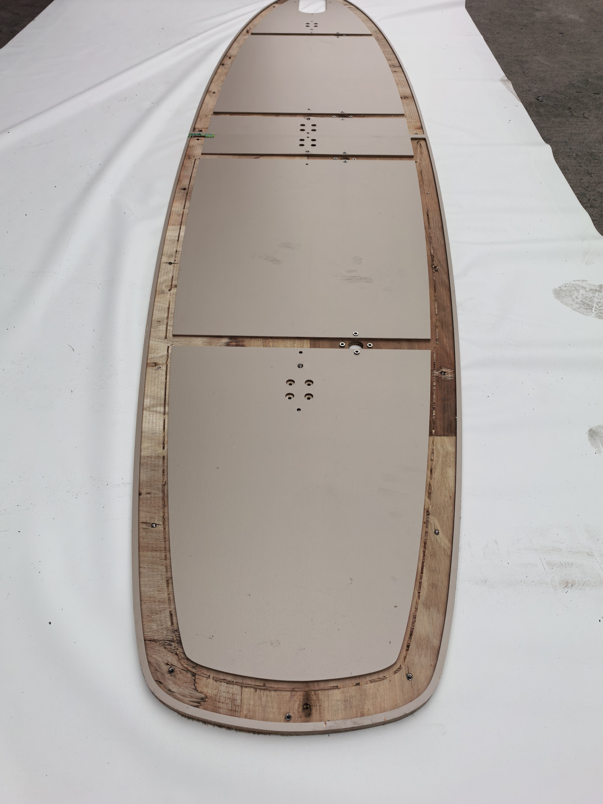
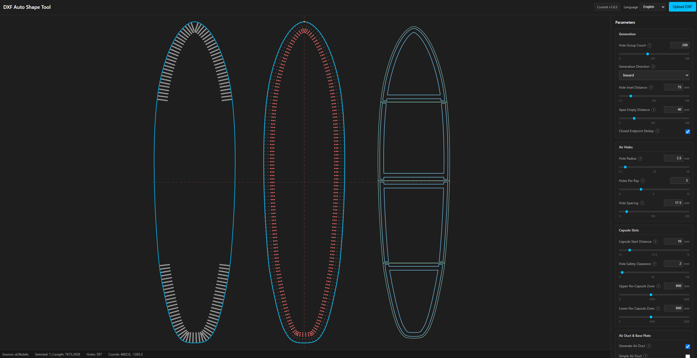

# Surfboard Vacuum Fixture DXF Tool

[简体中文](README.zh-CN.md)

I built this tool to help my dad's company make custom vacuum fixtures for surfboard machining. It takes a surfboard outline, lets the user adjust the hole and slot settings, and exports a DXF drawing for the fixture.

## Why I made it

My dad's company, Changzhou Rufa Machinery Co., Ltd. (常州市如发机械有限公司), makes machines that shape surfboards. During machining, a custom base holds the surfboard in place using vacuum suction. Different customers have different board shapes, so the base needs to match each one.

Before I made this program, the company had to draw a new base for each new surfboard model. Each design took several hours, even though much of the work followed the same pattern. I wanted to turn those repeated drawing steps into something the computer could do.

With this tool, the user imports the board outline, adjusts the parameters, and generates the drawing. In my dad's company's workflow, this takes **less than 30 seconds**, compared with **several hours per design** before. That time is for preparing the drawing; machining the physical base is a separate step.

## From the drawing to a real part

The photo below shows a vacuum fixture made using a drawing generated by my program. This is the custom base used to hold a surfboard during machining. It shows how the output of the software becomes a physical part for the company's machines.

<p align="center">
  
</p>

*A physical fixture made from the program's generated drawing.*

## How I use it

1. Import a DXF file containing the surfboard outline.
2. Select the edges that the generated geometry should follow.
3. Adjust the hole sizes, spacing, slot settings, and areas where slots should be left out. Check the result in the preview.
4. Export the new DXF drawing for review in CAD/CAM software before machining.

The interface lets the user change settings without redrawing the whole layout. Preview guides help show how the holes and slots are arranged; the exported DXF contains the machining geometry.



## What I used

| Part | Tools | What it does |
| --- | --- | --- |
| Backend | Python, FastAPI | Runs locally and handles file uploads and drawing generation. |
| Drawing logic | ezdxf and custom geometry code | Reads the outline and generates suction holes, capsule-shaped slots, and air ducts. |
| Interface | HTML, CSS, JavaScript, SVG | Displays the outline, selected edges, parameters, and preview. |
| Windows setup | Launch scripts, PyInstaller | Provides local startup and packaging options. |

## Run it locally

Install Python and Git, then run:

```bash
git clone https://github.com/Ha22yX/dxf-auto-shape-tool.git
cd dxf-auto-shape-tool
pip install -r requirements.txt
python main.py
```

The program starts a local server and opens the interface in a browser. If the browser does not open automatically, go to [http://127.0.0.1:8000](http://127.0.0.1:8000), the default local address.

For Windows, [`scripts/windows/start-manager-hidden.vbs`](scripts/windows/start-manager-hidden.vbs) also provides a launcher for the local service manager. The current interface is in Chinese.

## A few practical notes

- I built this around the workflow at my dad's company. Other fixture designs may need different geometry rules or settings.
- Start with a clean DXF outline and check that the correct edges are selected.
- Hole spacing, slot clearances, symmetry, and no-slot areas need to suit the actual fixture.
- Review the exported file in CAD/CAM software before making the part.

## Files in this project

```text
backend/                 Python service and DXF geometry code
frontend/                Browser interface and SVG preview
scripts/windows/         Windows launch scripts
packaging/               PyInstaller configuration and build script
docs/assets/             Interface screenshot and physical fixture photo
Test Files/              Sample DXF files
tests/                   Geometry, DXF, interaction, and WebSocket tests
main.py                  Starts the local server and opens the browser
```

## License

[MIT](LICENSE).
