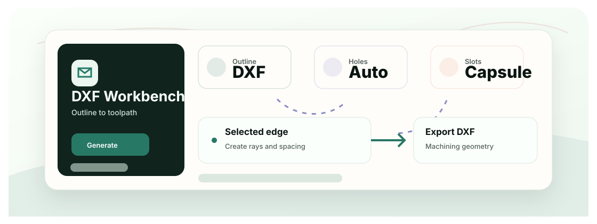

<div align="center">
  <h1>Surfboard Vacuum Table DXF Generator</h1>
  <p>一个本地 CAD 自动化工具，可从冲浪板 DXF 轮廓生成真空台吸孔和胶囊槽几何。</p>

  <p>
    <a href="README.md">English</a>
    &middot;
    <a href="#快速开始">快速开始</a>
    &middot;
    <a href="#技术栈">技术栈</a>
  </p>

  <p>
    
    
    
  </p>
</div>

<p align="center">
  
</p>

## 项目价值

当吸孔和槽位需要沿着曲线板边生成时，手工编辑 DXF 很慢且容易出错。本工具把轮廓选择转换成可重复的加工几何。

## 快速开始

```bash
git clone https://github.com/Ha22yX/dxf-auto-shape-tool.git
cd dxf-auto-shape-tool
pip install -r requirements.txt
python main.py
```

在 Windows 上，`scripts/windows/start-manager-hidden.vbs` 可启动本地服务管理器。

## 核心功能

- 上传并预览冲浪板轮廓 DXF。
- 选择目标边后生成射线、吸孔和胶囊槽。
- 提供对称辅助、禁槽区域、重叠孔移除和仅预览辅助几何。
- 导出干净的 DXF 加工几何，供后续制造使用。

## 技术栈

| Layer | Technology | Role |
| --- | --- | --- |
| 后端 | FastAPI, Python | DXF 处理和本地 Web 服务。 |
| 几何 | ezdxf, custom geometry helpers | 读取轮廓并生成加工实体。 |
| 前端 | HTML, CSS, JavaScript, SVG | 交互预览和参数面板。 |
| 打包 | Windows scripts / PyInstaller spec | 本地启动器和可执行文件路径。 |


## 项目说明

这是面向特定冲浪板真空台流程的实用制造辅助工具，不是通用 CAD 软件。
